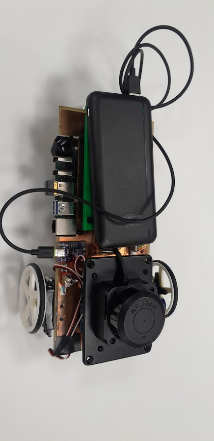
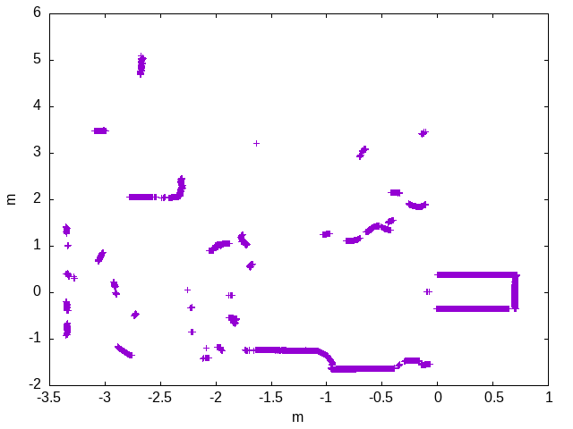

# Slamtec RPLIDAR C1 driver class for Rock5



This project describes how to connect a Slamtech RPLIDAR C1 directly
to a Rock5 by using its in-built serial port.

A 360 degree scan is provided by a callback at the sampling rate
of the LIDAR at 600RPM (10Hz).

## Hardware setup

Connect the LIDAR to the UART pins of the Rock5.


## Software

### Prerequisites

This howto is for the Rock5 ARMbian.

Enable the UART for serial communication. Start `sudo nano /boot/armbianEnv.txt`, identify these lines and add/edit them that
they look like these:

```
console=display
overlay_prefix=
overlays=rk3588-uart2-m0
```

This enables the UART.

Add yourself to the group dialout to allow access to /dev/tty*.

### Installation

`cmake .`

`make`

`sudo make install`

This installs the library and can then be used in your application.

## C1Lidar class

The class has `start()` and `stop()` functions which start and
stop the data acquisition and also start and stop the motor of
the range finder.

The data is transmitted via `DataInterface` where the abstract function
`newScanAvail(A1LidarData (&)[A1Lidar::nDistance]) = 0` needs to be implemented
which then receives both the polar and Cartesian coordinates after
a successful 360 degree scan. Register your `DataInterface` with
`registerInterface`.

## Example program
`printdata` prints tab separated distance data as
`x <tab> y <tab> r <tab> phi <tab> strength` until a key is pressed.

Pipe the data into a textfile and plot it with `gnuplot`:
```
sudo ./printdata > tt2.tsv
gnuplot> plot "tt2.tsv"
```


`printRPM` prints the current RPM until you press ctrl-C.

## Credits

The `rplidarsdk` folder is the `sdk` folder
from the official Slamtec git:

https://github.com/Slamtec/rplidar_sdk
